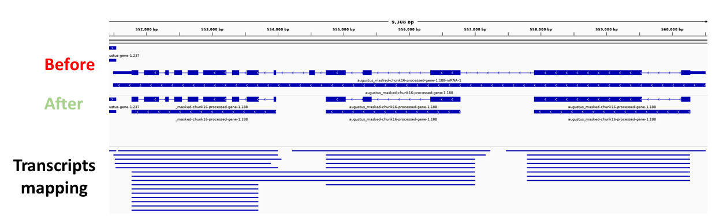

# chimeraBuster
chimeraBuster is a tool for correcting chimeric gene annotations.  


## Installation and running
chimeraBuster was tested on Linux, but should also run on Windows/Mac.  
### Requirements
* Git
* python (any version)
* conda (Anaconda/Miniconda, compatible with the python version)
### Installation
```
$ git clone git@github.com:MayroseLab/chimeraBuster.git
$ cd chimeraBuster/
$ conda env create -f env.yml
$ conda activate chimeraBuster
$ python chimeraBuster.py -h
usage: python chimeraBuster.py -h (display full usage doc)

ChimeraBuster: break chimeric gene models based on transcript mapping

optional arguments:
  -h, --help            show this help message and exit
  -g GFF, --gff GFF     Input GFF
  -f GENOME_FASTA, --genome_fasta GENOME_FASTA
                        Input genome in FASTA format
  -t TRANSCRIPTS, --transcripts TRANSCRIPTS
                        Transcripts to be mapped to the genome, in FASTA format
  -m MAPPING, --mapping MAPPING
                        Transcripts mapping to the genome, in minimap2 PAF format
  -d GFF_DB, --gff_db GFF_DB
                        GFF DB from a previous run
  -o OUTPUT, --output OUTPUT
                        Output path
  -r, --do_not_refine   Skip mapping region refining step for a quick-and-dirty analysis
  -n MIN_TRANSCRIPTS, --min_transcripts MIN_TRANSCRIPTS
                        Minimum number of transcripts in mapping region
  -q MIN_QUERY_COV, --min_query_cov MIN_QUERY_COV
                        Minimum transcript query coverage (0-1)
  -c CPUS, --cpus CPUS  Number of CPUs to use
  -v, --verbose         Increase verbosity
```
### Running a test data set
```
$ python chimeraBuster.py -g test/genes.gff -f test/genome.fasta -t test/transcripts.fasta -o test_result
```
A new directory called test_result should be created. The list of genes detected as chimeric can be found in test_result/chimeric_genes.list (should include three genes) and the gff with corrected genes is at test_result/genes.gff.corrected.gff.

### How does it work?
chimeraBuster detects and corrects chimeric gene annotation based on transcript (cDNA) alignments. The main inputs are:
* The genome sequence
* The annotation to be corrected
* Transcript sequences  

The tool applies a series of steps to achieve its goal:
1. Map transcript sequences to the genome (using Minimap2).
2. Filter transcript mappings by removing ones with low query coverage.
3. Determine transript "mapping regions" - these are genomic regions where multiple transcripts are mapped. Overlapping regions are merged into longer regions.
4. Refine mapping regions - the purpose of this step is to remove "outlier" mappings. Usually these are mappings bridging over two (or more) otherwise non-overlapping mapping regions. Outliers are detected using the DBSCAN clustering algorithm, and removed. Mapping regions are re-computed.
5. Detect chimeric genes - a gene model spanning more than one mapping region is considered a putative chimeric gene.
6. Correct (break) chimeric genes - chimeras are broken according to the mapping regions, and the starts/ends of the new genes are corrected by searching for start/stop codons.

### Inputs and parameters
| Parameter  | Description |
| ------------- | ------------- |
| -g GFF, --gff GFF | Input annotation, in GFF3 format. All features must have an ID, or Name, or Parent attribute. |
| -f GENOME_FASTA, --genome_fasta GENOME_FASTA | Input genome in FASTA format. Record names must match the ones in the GFF3 file. |
| -t TRANSCRIPTS, --transcripts TRANSCRIPTS | Transcripts to be mapped to the genome, in FASTA format. Prefereably high quality cDNA or transcriptome assembly. |
| -m MAPPING, --mapping MAPPING | Instead of providing transcript sequences, provide transcripts mapping to the genome, in minimap2 PAF format. |
| -d GFF_DB, --gff_db GFF_DB | Instead of providing a GFF file, use a [gffutils](https://pythonhosted.org/gffutils/) GFF DB from a previous run |
| -o OUTPUT, --output OUTPUT | A path where all intermediate and result files will be written to. The directory will be created if it does not already exists. Will override results from previous runs. |
| -r, --do_not_refine | Skip mapping region refining step for a quick-and-dirty analysis (not recommended) |
| -n MIN_TRANSCRIPTS, --min_transcripts MIN_TRANSCRIPTS | Minimum number of transcripts in a mapping region (2 by default). Mapping regions with less transcripts will be ignored and no chimeras will be detected based on these regions. |
| -q MIN_QUERY_COV, --min_query_cov MIN_QUERY_COV | Minimum transcript query coverage (0-1, 0.95 by default). This cutoff will be used when filtering transcript mappings. Query coverage is calculated as the number of matches devided by the query length. |
| -c CPUS, --cpus CPUS | Number of CPUs to use for running Minimap2 and for refining mapping regions. |
| -v, --verbose | Increase verbosity. Mainly useful for debugging. |

### Outputs
The final outputs are written to the output directory:  
* chimeric_genes.list - a list of gene IDs detected as putative chimeras.
* \<input GFF base name\>.corrected.gff - a GFF3 file with chimeric genes broken into multiple genes. The source of these genes is set to 'chimeraBuster' and indicative IDs are assigned.

Note that in cases where breaking chimeric genes cannot be performed reliably, genes listed as putatively chimeric will be kept unchanged.  
In addition, chimeraBuster ignores overlapping genes since they cannot be reliably analyzed based on transcript data.
